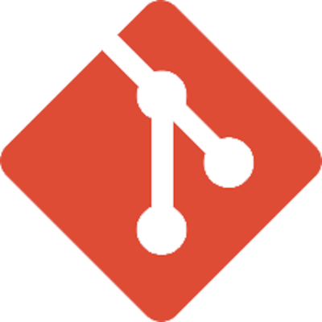

---
hide:
  - navigation
  - toc
glightbox: false
---

# Hi there!

I'm Berk, computer engineering student and software developer. I'm interested in mostly backend and
Linux stuff.

[Notes](./notes/index.md) | [Blog](./blog/index.md) | [Projects](./projects/index.md)

GitHub: :octicons-mark-github-16: [berk-karaal](https://github.com/berk-karaal/)

-   Tech Stack

    ---
    
    
    

    
    
    
    
    
    
    
    

-   :notepad_spiral: Latest Notes

    ---

    [:notepad_spiral: Git / Setup Git in a new machine](./notes/git/setup.md)

    [:notepad_spiral: Linux / Programs / dust](./notes/linux/programs/dust/index.md)

-   :books: Latest Blogs

    ---

    :books: [Benim Klavyem Benim
    Tuşlarım](./blog/posts/2023-12-06-benim-klavyem-benim-tuslarim/index.md)

    [:books: Debug and Run](./blog/posts/2022-09-30-debug-and-run/index.md)

    [:books: Öğrenmeye ve Geliştirmeye Devam](./blog/posts/2022-06-18-ogrenmeye-ve-gelistirmeye-devam/index.md)

    [:books: Stajda Yeni Görev: API Testleri](./blog/posts/2022-05-05-stajda-yeni-gorev-api-testleri/index.md)

Send an email for any questions, CV or job offers:
[iletisim.berkkaraal@gmail.com](mailto:iletisim.berkkaraal@gmail.com)
