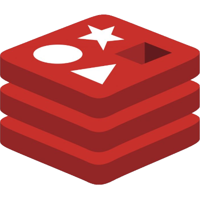
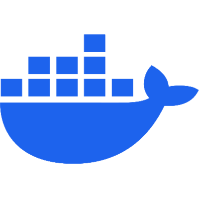

---
hide:
  - navigation
  - toc
---

# Hi there!

I'm Berk, computer engineering student and software developer. I'm interested in mostly backend and
Linux stuff.

[Notes](./notes/index.md) | [Blog](./blog/index.md) | [Projects](./projects/index.md)

GitHub: :octicons-mark-github-16: [berk-karaal](https://github.com/berk-karaal/)

-   Tech Stack

    ---
    
    
    

    
    
    
    
    
    
    
    

Send an email for any questions, CV or job offers:
[iletisim.berkkaraal@gmail.com](mailto:iletisim.berkkaraal@gmail.com)