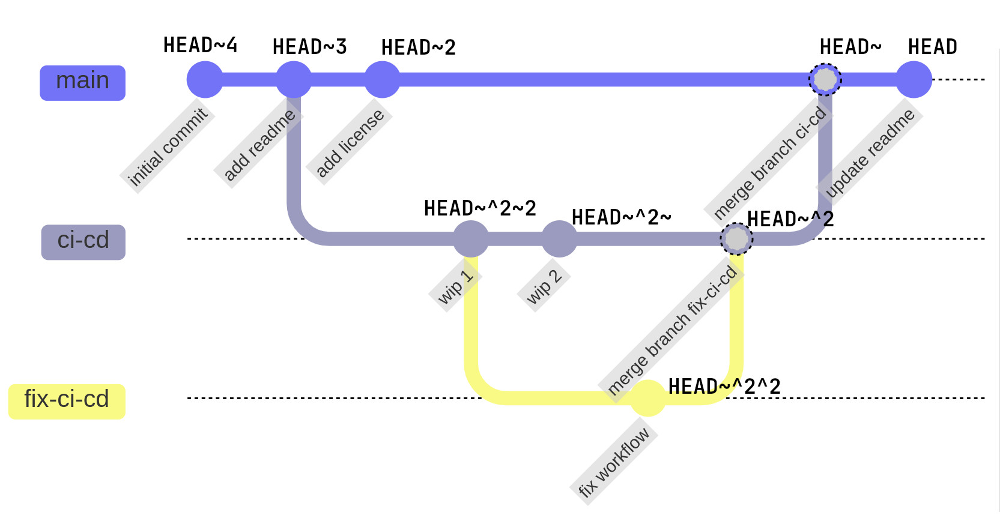

# Tilde and Caret in Git

I run into `~1` and `^1` commands used interchangeably in Git commands but I never really understood
the difference between them. Such as `git reset HEAD~1` and `git reset HEAD^1` usages. As it turns
out, even though the output is the same, they are not the same thing. 

**TLDR;** Tilde points the first parent commit, while caret points the specified parent of a commit.
See [Example Visual Git Graph](#example-over-a-visual-git-graph)

## Tilde (~)

Tilde (`~`) is used to **point the first parent commit**. A commit can have multiple parents in
case of a merge commit, such as `a4079a6` in the example below. Tilde follows the first parent.

Example:

```console
$ git log --graph --oneline --date-order
*   a4079a6 (HEAD -> main) Merge branch 'feature-1'
|\
* | 878f26d add readme
| * c482dd1 (feature-1) add tests
| * 9b5e39e wip 2
| * b23144e wip 1
|/
* 9786a71 initial commit

$ git show -s --oneline HEAD
a4079a6 (HEAD -> main) Merge branch 'feature-1'

$ git show -s --oneline HEAD~
878f26d add readme

$ git show -s --oneline HEAD~2
9786a71 initial commit
```

You can use multiple consecutive tildes to follow the first parent multiple times. Or you can use
`HEAD~n` to follow the first parent `n` times. (`HEAD~` = `HEAD~1`, `HEAD~~` = `HEAD~2`, etc.)

## Caret (^)

Caret (`^`) is used to **point a specific parent of a commit**. With tilde you can
only point the first parent, but with caret you choose which parent to follow.

By default, `HEAD^` means the first parent which is the same as `HEAD~`. `HEAD^2` means the second
parent, `HEAD^3` means the third parent, and so on.

Example:

```console
$ git log --graph --oneline --date-order
*   a4079a6 (HEAD -> main) Merge branch 'feature-1'
|\
* | 878f26d add readme
| * c482dd1 (feature-1) add tests
| * 9b5e39e wip 2
| * b23144e wip 1
|/
* 9786a71 initial commit

$ git show -s --oneline HEAD^
878f26d add readme

$ git show -s --oneline HEAD^2
c482dd1 (feature-1) add tests

$ git show -s --oneline HEAD^2~
9b5e39e wip 2

$ git show -s --oneline HEAD^2~2
b23144e wip 1
```

Be aware in the caret usage, `HEAD^2` is not the same thing as `HEAD^^`. `HEAD^2` means the second
parent of the commit, while `HEAD^^` means the first parent of the first parent of the commit.

Even though in practice you can, I prefer not use `HEAD^` instead of `HEAD~` to avoid confusion. And
I suggest you to do the same. Only use caret when you need to specify a parent other than the first
one.

<br>

I only gave examples relative to `HEAD` but you can use these notations with commit hashes. For
example, `$ git show c482dd1~` will show the first parent of the commit `c482dd1`.

## Example Over a Visual Git Graph

Here is an example Git graph to demonstrate the usage of tilde and carets for specifying commits relative to `HEAD`:



<details>
<summary>Mermaid source code for the graph:</summary>

```text
gitGraph
    commit id: "initial commit"
    commit id: "add readme"
    branch ci-cd
    checkout main
    commit id: "add license"
    checkout ci-cd
    commit id: "wip 1"
    branch fix-ci-cd
    checkout ci-cd
    commit id: "wip 2"
    checkout fix-ci-cd
    commit id: "fix workflow"
    checkout ci-cd
    merge fix-ci-cd id: "merge branch fix-ci-cd"
    checkout main
    merge ci-cd id: "merge branch ci-cd"
    commit id: "update readme"
```

</details>


<details>
<summary>Create this history in Git:</summary>

```console
$ git init

$ git commit --allow-empty -m "initial commit"
[main (root-commit) 06cd678] initial commit

$ git commit --allow-empty -m "add readme"
[main 4a84c04] add readme

$ git checkout -b ci-cd
Switched to a new branch 'ci-cd'

$ git checkout main
Switched to branch 'main'

$ git commit --allow-empty -m "add license"
[main 60f2398] add license

$ git checkout ci-cd
Switched to branch 'ci-cd'

$ git commit --allow-empty -m "wip 1"
[ci-cd 3986280] wip 1

$ git checkout -b fix-ci-cd
Switched to a new branch 'fix-ci-cd'

$ git checkout ci-cd
Switched to branch 'ci-cd'

$ git commit --allow-empty -m "wip 2"
[ci-cd 705e155] wip 2

$ git checkout fix-ci-cd
Switched to branch 'fix-ci-cd'

$ git commit --allow-empty -m "fix-workflow"
[fix-ci-cd 89403bd] fix-workflow

$ git checkout ci-cd
Switched to branch 'ci-cd'

$ git merge fix-ci-cd
Merge made by the 'ort' strategy.

$ git checkout main
Switched to branch 'main'

$ git merge ci-cd
Merge made by the 'ort' strategy.

$ git commit --allow-empty -m "update readme"
[main ba3ce9c] update readme

$ git log --graph --oneline --date-order
* ba3ce9c (HEAD -> main) update readme
*   699b2d3 merge branch 'ci-cd'
|\
| *   1d86cc1 (ci-cd) merge branch 'fix-ci-cd'
| |\
| | * 89403bd (fix-ci-cd) fix-workflow
| * | 705e155 wip 2
| |/
| * 3986280 wip 1
* | 60f2398 add license
|/
* 4a84c04 add readme
* 06cd678 initial commit
```

You can check out the commits using `$ git show -s -oneline HEAD~` like in the examples above.

</details>
