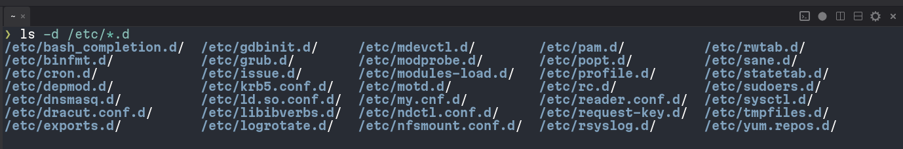

# Drop-in Config Directories

Many Linux programs read one main config file plus every file inside a companion directory
named `something.d`, then merge them all. The `.d` suffix just means "directory". This is the
drop-in directory convention. It started with `init.d` and `cron.d` and has since spread to most
of the system.

```
/etc/sysctl.conf        # main file
/etc/sysctl.d/          # drop-in directory
├── 10-default.conf
├── 50-coredump.conf
└── 99-mine.conf
```

<figure markdown="span">
    
  <figcaption>Top-level drop-in directories on a Fedora machine</figcaption>
</figure>

## Why it exists

A single config file has an ownership problem. The distro ships it, the package manager wants to
update it, other packages want to add their own settings to it, and you want to edit it. Everyone
touching the same file leads to `.rpmnew` and `.dpkg-dist` leftovers after upgrades, and to
install scripts that try to `sed` lines into place.

With a drop-in directory each party owns its own file. The package manager can replace its files
freely, you own yours, and nothing steps on anything else. Removing a setting means deleting a
file, not hunting for a line.

## Common rules

Details vary between tools, but most implementations share the same shape:

- **Alphabetical order.** Files are read sorted by name, so numeric prefixes like `10-`, `50-`,
  `90-` control precedence. When the same key appears twice, the later file wins.
- **Vendor vs local.** Distro defaults live under `/usr/lib/` or `/usr/share/`, local overrides
  under `/etc/`. A file in `/etc/` with the same name as one in `/usr/lib/` masks it completely.
  Symlinking that name to `/dev/null` in `/etc/` is the usual way to disable a vendor file.
- **Extension filter.** Only files with the expected extension (`.conf`, `.repo`, `.list`, ...)
  are read, so a stray `.bak` or editor swap file is ignored.
- **Section header.** Some tools need the file to start with a section header so the parser knows
  where the keys belong, like `[main]` for dnf.
- **Main file precedence varies.** systemd parses drop-ins after the unit file, so they win. dnf5
  parses `/etc/dnf/dnf.conf` after its drop-ins, so the main file wins. Check the tool's man page
  before relying on either.

## Where you will see it

Kernel and boot:

- `/etc/sysctl.d/`, `/etc/modprobe.d/`, `/etc/modules-load.d/`
- `/etc/udev/rules.d/`, `/etc/tmpfiles.d/`

systemd:

- `/etc/systemd/system/foo.service.d/override.conf` patches a unit without copying the whole
  file. `systemctl edit foo` creates this for you.
- `/etc/environment.d/`

Login and shell:

- `/etc/sudoers.d/`, `/etc/pam.d/`, `/etc/profile.d/`
- `~/.config/fish/conf.d/` is the same idea in user space

Package managers:

- `/etc/yum.repos.d/` and `/etc/dnf/libdnf5.conf.d/` for dnf
- `/etc/apt/sources.list.d/` and `/etc/apt/apt.conf.d/` for apt

SSH:

- `/etc/ssh/sshd_config.d/` and `~/.ssh/config.d/`, pulled in by an `Include` line in the main
  file

## Why it matters for dotfiles

Many people keep their personal config files in a git repository, often called a dotfiles repo
because most of those files start with a dot (`.bashrc`, `.gitconfig`, `.config/`). The repo
is then linked into place on each machine, either by hand with `ln -s` or with a helper like
GNU Stow, so a fresh install gets the same setup with one command.

Drop-in directories make this much cleaner. Take dnf as an example. You want to set
`max_parallel_downloads=10` on every machine you own. There are two ways to do it:

- **Edit the main file.** Put your version of `/etc/dnf/dnf.conf` in the repo and link it over
  the original. Now you own the whole file. When Fedora ships a new default in that file, you
  either miss it or have to merge it by hand. Some package managers will also complain that the
  file is modified on every upgrade.
- **Use the drop-in directory.** Put a tiny `/etc/dnf/libdnf5.conf.d/99-mine.conf` in the repo
  containing only your setting and link it into place. Fedora keeps full ownership of
  `dnf.conf`, upgrades never touch your file, and the repo carries only the lines you actually
  chose.

The second option keeps the repo small and readable, since every file in it is a setting you
picked on purpose. It also makes cleanup trivial: remove the symlink and the machine is back to
stock.

When setting up a tool, look for a drop-in directory first. If there is none, the next best
option is an `Include` directive in the main file that points at your file. Only when neither
exists do you take over the main file itself.

## Further reading

- [sysctl.d(5)](https://www.freedesktop.org/software/systemd/man/latest/sysctl.d.html), section
  "Configuration Directories and Precedence". The closest thing to a spec: search path order,
  lexicographic sorting, `/dev/null` masking, and the suggested `10-40` vendor / `60-90` admin
  numbering.
- [systemd.unit(5)](https://www.freedesktop.org/software/systemd/man/latest/systemd.unit.html)
  documents `foo.service.d/` drop-ins and their precedence over the unit file.
- [dnf5.conf(5)](https://dnf5.readthedocs.io/en/latest/dnf5.conf.5.html) documents
  `/etc/dnf/libdnf5.conf.d/` and the read order.
- [Understanding *.d directories in /etc](https://www.redhat.com/sysadmin/etc-configuration-directories)
  by Susan Lauber. A readable overview with logrotate, cron, pam and Apache examples.
