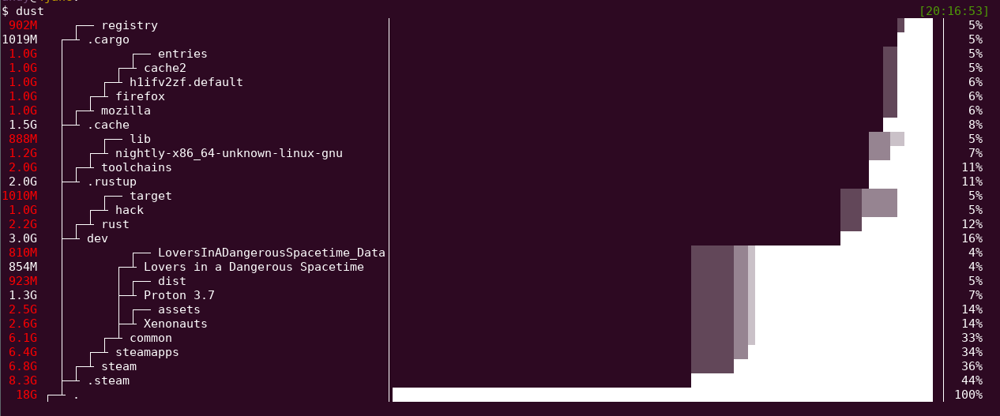

# Dust

Dust is a great program to see where your disk space is being used. It shows the files and
directories that are using the most space on your disk.

<figure markdown="span">
    
  <figcaption>Demo from project repo</figcaption>
</figure>

You can install it with `cargo`.

GitHub repo: [github.com/bootandy/dust](https://github.com/bootandy/dust)